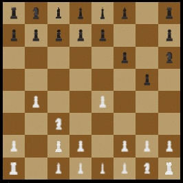
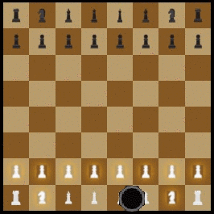
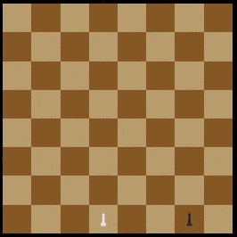

# Chess 2016, NYU

## What has been done
- Chess game with all classic rules and advanced rules (even enPassant, castling, etc.)
- AI which selects an attack move or a random move, favorising low importance pieces such as the pawn.
- Rotation (only when there is a player vs player)
- Three different modes supported:
  - Normal mode ([Player vs Player](https://qdm12.github.io/Chess_2016/))
  
  
  
  - Player vs AI ([?playAgainstComputer](https://qdm12.github.io/Chess_2016/?playAgainstTheComputer))
  
  
  
  - AI vs AI ([?onlyAIs](https://qdm12.github.io/Chess_2016/?onlyAIs))

  

- Karma unit tests for gameLogic (95%), aiService (100%)
  - Screenshot of the 58 unit tests passing 
  - Screenshot of the total code coverage 
- Online website at [pgbomit.com](https://www.pgbomit.com)
  - Screenshot of the pgbomit.com website 
- PhoneGap present at [github.com/tropicdragon/phonegap-tictactoe](https://github.com/tropicdragon/phonegap-tictactoe)
- Dist version

## How to run tests
To run tests with Karma:
- Install npm and grunt somehow
- `grunt karma` in the working directory

## Future work
- Write end-to-end tests
- Use more plugins for PhoneGap and add the app on Apple store, Play store and so on
- Setup Jenkins with Markdown badge to show the code coverage.
- Finish integrating the chat with Firebase.
- Improve AI with "one move ahead thinking".
- Add translations and text (there is no text for now)
- Show a nice display message when the game is over, instead of just the JS alert.
- Add AI animations instead of instantaneous moves.
- Display a Promotion menu in Javascript when a pawn reaches the other side.
- Fix up checkmoveok eventually to reach 100% code coverage.
- Show pieces removed from the game
- Show a temporary notification when a special move is used (enpassant, castling...)

## Authors
- Quentin McGaw
- Tianmao Jiang / Javons / Jeremy 
- Alexandra Serralta
